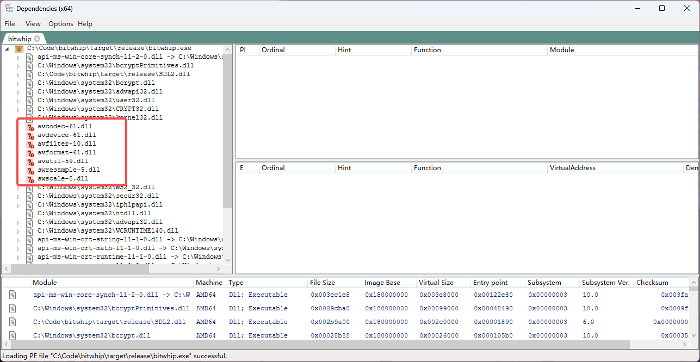

# windows

## 查看 exe 依赖的 dll 库

Dependencies 是对遗留软件 Dependency Walker 的重写，可以帮助 Windows 开发人员解决他们的 dll 加载依赖项问题。支持命令行和GUI界面两种方式。

> <https://github.com/lucasg/Dependencies>

可以通过 gui 或者命令行查看一个 exe 依赖的 dll 库：



## 增加动态库搜索路径

在 Linux 上是通过 LD_LIBRARY_PATH 环境变量实现的，Windows 上需要用 Path：

```powershell
$env:PATH += ";ext\ffmpeg-n7.1.1-54-g6400860b9d-win64-gpl-shared-7.1\bin"

# 验证是否生效
$env:PATH -split ';' | Select-String "ffmpeg"
```
